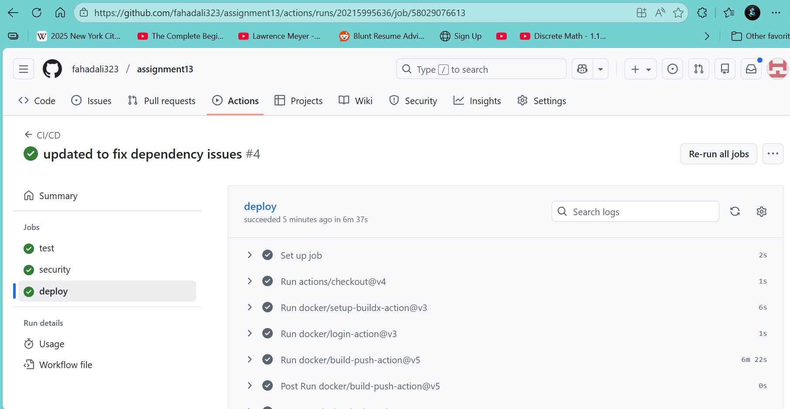
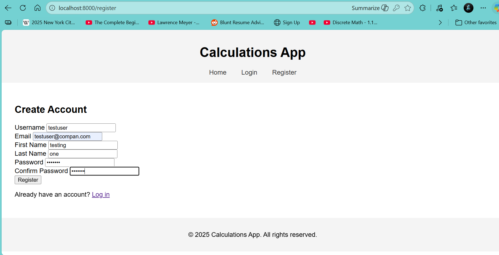
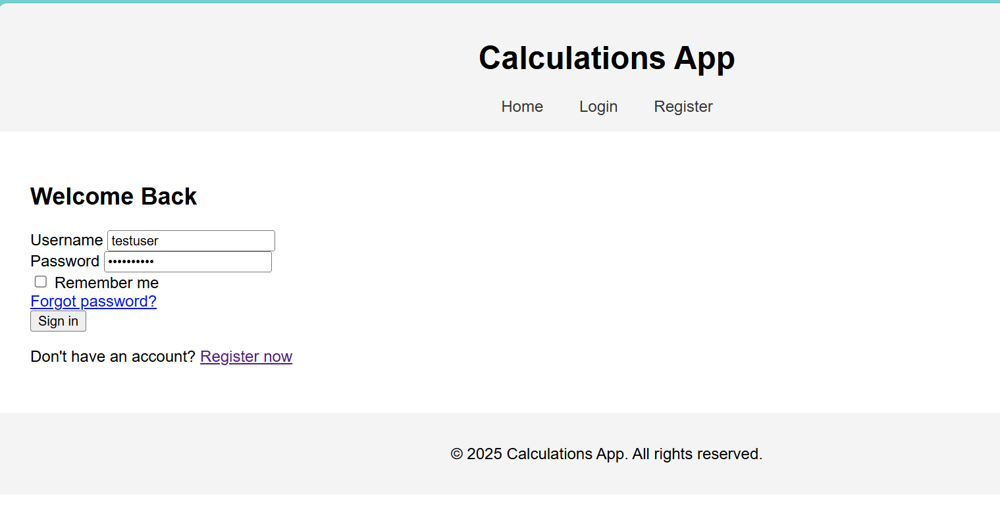
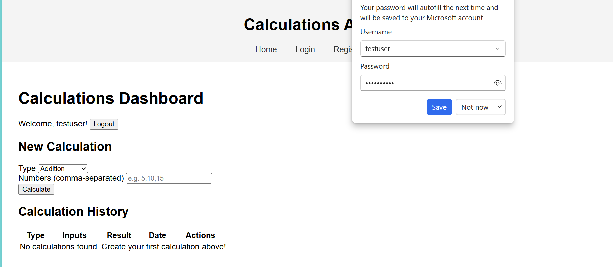
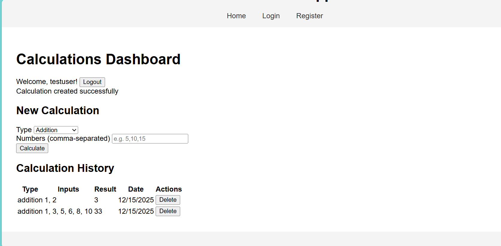

# 📦 Project Setup

## Screenshots:

1. GitHub Actions Workflow: Screenshot showing a successful run of the GitHub Actions workflow.
Screenshot: 
2. Playwright E2E Tests: Screenshot demonstrating Playwright tests passing.
Screenshot:  
3. Front-End Application: Screenshot of the login and registration pages functioning correctly.
Screenshot: 

